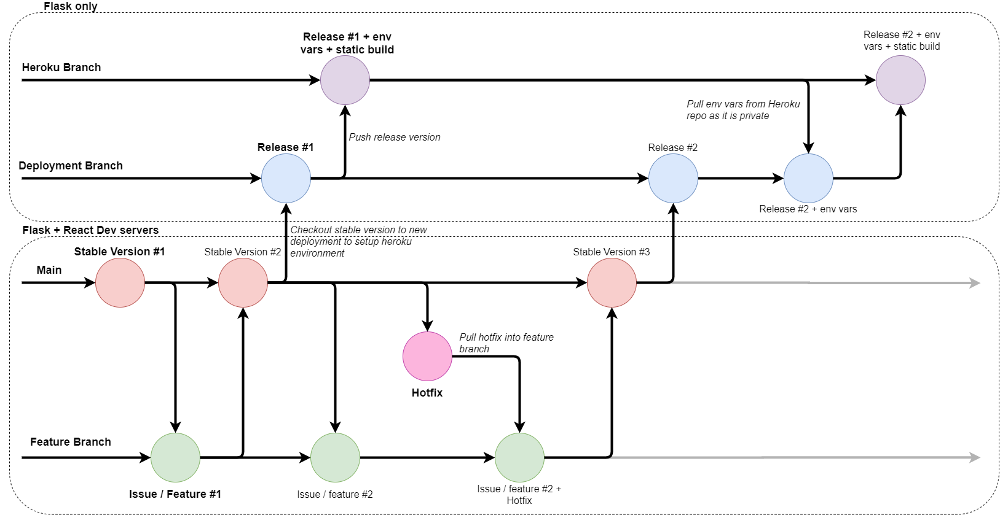

# The BEVis Redesign - BEVFERLE

This is the main repo for the redesign project of a research tool developed in 2020 for my engineering honours project.

BEVis (the Bus Emissions Visualiser) is a tool that creates views of data on dynamic visualisations. The visualisations were designed and implemented
with a team of 3 software developers working with Greater Wellington Regional Council/NZTA to develop a research tool; in conjunction with Victoria University. 
The datasets the tool operates on was created from a mixture of several sources and was developed during this project as well.

BEVFERLE (Bus Emissions Visualiser For Emissions Research of Local Environments, pronounced "Beverly") is a redesign and refactor of the original codebase left after these projects. It uses React for UI, Redux for state management,
and has a Python (Flask) backend

### New Workflow

## Licensing info

### Favicon

The emoji graphics (favicon) are from the open source project [Twemoji](https://twemoji.twitter.com/). The graphics are copyright 2020 Twitter, Inc and other contributors. The graphics are licensed under [CC-BY 4.0](https://creativecommons.org/licenses/by/4.0/).

- Graphics Title: 1f68c.svg
- Graphics Author: Copyright 2020 Twitter, Inc and other contributors (https://github.com/twitter/twemoji)
- Graphics Source: https://github.com/twitter/twemoji/blob/master/assets/svg/1f68c.svg
- Graphics License: CC-BY 4.0 (https://creativecommons.org/licenses/by/4.0/)
